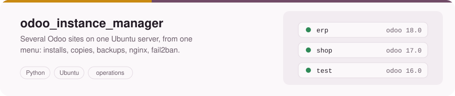
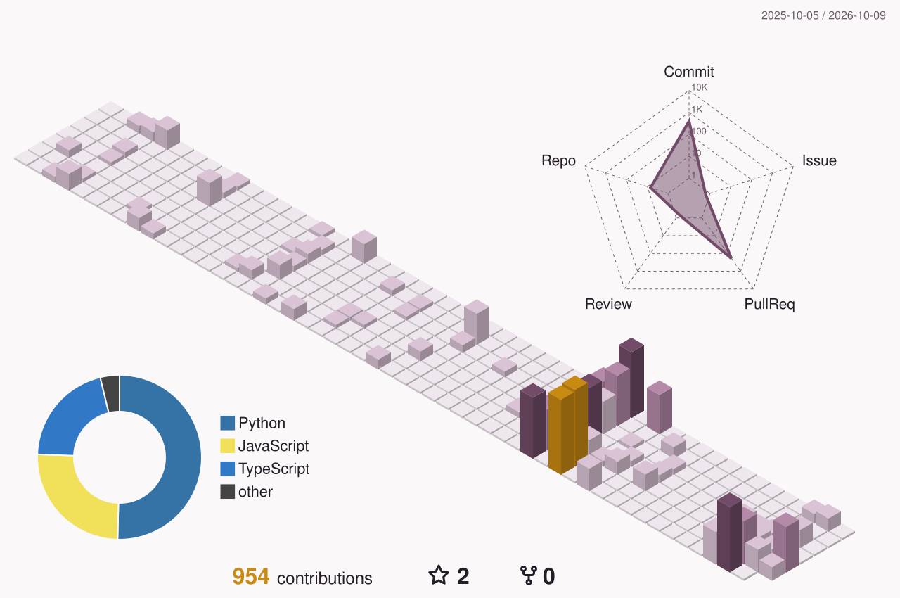

<picture>
  <source media="(prefers-color-scheme: dark)" srcset="assets/header-dark.svg" />
  
</picture>

I turn complex requirements into solutions that run in **real production** — owning the full cycle from
analysis and architecture to development, integrations and deployment.

## What I'm building

<a href="https://github.com/grojof/odoo_dev_workspace_generator">
  <picture>
    <source media="(prefers-color-scheme: dark)" srcset="assets/card-dwg-dark.svg" />
    
  </picture>
</a>

<a href="https://github.com/grojof/odoo_instance_manager_app">
  <picture>
    <source media="(prefers-color-scheme: dark)" srcset="assets/card-im-dark.svg" />
    
  </picture>
</a>

<a href="https://github.com/grojof/eunomai">
  <picture>
    <source media="(prefers-color-scheme: dark)" srcset="assets/card-eunomai-dark.svg" />
    
  </picture>
</a>

## Upstream

I contribute fixes back to the [Odoo Community Association](https://github.com/OCA) — mostly OpenUpgrade,
where migrations from 12.0 onwards meet real client data. See
[my merged pull requests](https://github.com/search?q=is%3Apr+author%3Agrojof+org%3AOCA+is%3Amerged&type=pullrequests).

## How I work

- **Spec first.** What a change must do is written and agreed before the first line of code.
- **Small, previewed, reversible steps.** Plan, preview, confirm, apply: nothing touches a server or a
  database before I've seen exactly what it will do.
- **Verified by running it.** Generated scripts go through ShellCheck, a throwaway PostgreSQL and a real Odoo;
  versions, limits and tax rules are cited from the source, not from memory.
- **Docs move with the code.** The README, the specs and the changelog change in the same pull request as the
  code they describe.

## Activity

<picture>
  <source media="(prefers-color-scheme: dark)" srcset="profile-3d-contrib/profile-plum-dark.svg" />
  
</picture>

## About me

- **Odoo & ERP** — custom modules for inventory, manufacturing and production, plus bidirectional
  integrations with **Microsoft Business Central** and other systems.
- **Full-stack & systems** — autonomous across backend, frontend and infrastructure, on a decade of sysadmin
  and cloud experience.
- **AI engineering** — plugins, skills and agentic tooling for **Claude** and **GitHub Enterprise**, scaled
  across engineering teams.
- **Fast learner** — with a solid engineering foundation (and AI in the loop), I reach productive levels in
  new stacks quickly.

**Currently:** designing plugins and skills for Claude and GitHub Enterprise used by the company's dev teams,
and applying AI at the systems level across any stack a project needs.

## Stack

<picture>
  <source media="(prefers-color-scheme: dark)" srcset="assets/stack-dark.svg" />
  
</picture>

---

Always up for complex technical challenges, ownership, and solutions with real business impact —
[LinkedIn](https://www.linkedin.com/in/grojofernandez).
